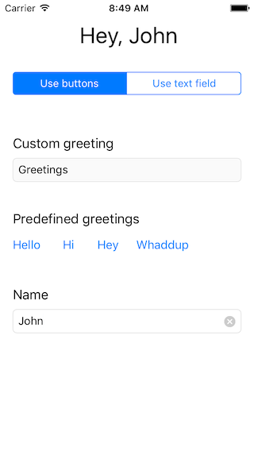

# GreetingGenerator-demo

### Overview

Let's build a small, one-viewcontroller app that let's us generate and display a greeting for a person that is composed of

1. a greeting (either _custom_ or _predefined_), e.g. `Hello`
2. the _name_ of the person to greet, e.g. `John`




The UI is composed of the following elements:

1. `greetingLabel`:
The `greetingLabel` contains the result of the greeting, e.g. `Hello, John`. The string is composed of the greeting and the name of the person to greet. The greeting can be either a custom greeting that the user types into the `greetingTextField` or one of the predefined greetings that the user can select by tapping on one of the buttons. The person's name needs to be typed in the `nameTextField`. 

2. `stateSegmentedControl`:
This segmented control indicates whether the greeting text on the `greetingLabel` should use the predefined greetings from the buttons or the custom greeting text that is inside the `greetingTextField`. Note that when switching between the two states, either the `greetingTextField` or the four greeting buttons should be _disabled_ (i.e. the `isEnabled` property needs to be set to `false`). 

3. `greetingTextField`:
The user can type a greeting into this text field. Note that the `greetingLabel` should be updated on every key stroke! This text field needs to be disabled when the user selects `Use buttons` in the `stateSegmentedControl`.

4. `greetingButtons`:
These are four buttons that each represent a predefined greeting. When tapping one of the buttons, the text on the `greetingLabel` should be updated accordingly. These buttons need to be disabled when the user selects `Use text field` in the `stateSegmentedControl`. For your implemenation, note that multiple `UIButton`s can be connected to only one `IBAction` and they can be contained in one `IBOutletCollection` (which is basically just an array of `IBOutlet`s).

5. `nameTextField`:
This text field is always enabled and contains the name of the person to greet. The `greetingLabel` should be updated on every keystroke in this text field.


### Implementation using `RxSwift`

Here is a suggestion for a possible progression to implement the required functionality for the `GreetingGenerator-demo`:

1. enabling/disabling the `greetingsTextField` that allows to enter the custom greeting
  - the _source of truth_ that decides whether the `greetingsTextField` should be enabled or not is the `selectedSegmentIndex` of the `stateSegmentedControl`
  - you can _observe_ this by using `stateSegmentedControl.rx.value.asObservable()`
  - in order for you to be able to bind the value of this observable to the `greetingsTextField.rx.isEnabled` property, you need to _transform_ the it to the appropriate type
2. enabling/disabling of the buttons 
  - use a similar approach as in one, but this time you need to _bind_ to all existing buttons rather than only to one text field
3. display the custom greeting on the `greetingsLabel`
  - _observe_ the input in the `greetingsTextField` and the `nameTextField` and _combine_ them
  - use the static function `combineLatest` that you can call on the `Observable` type; here is an (unrelated) example of how you can use `combineLatest` to create the sum of two integer values that you are observing:
```
        let a: Variable<Int> = ...
        let b: Variable<Int> = ...

        Observable.combineLatest(a.asObservable(), b.asObservable()) { valueA, valueB in
          return valueA+valueB
        }
```
  - once you used `combineLatest` to combine the values in the two text fields, you can _bind_ the result to the `greetingsLabel`
4. create a `Variable<String>` that stores (and emits) the latest value for the predefined greeting
  - the variable's `value` needs to be updated every time a button is pressed (with the predefined greeting that this button represents)
  - you can use a regular `@IBAction` to catch button taps, but if you want to go fully reactive, you'll subscribe to `button.rx.tap`
5. display the predefined greeting on the `greetingsLabel`
  - _observe_ the variable that you created in the previous step and _combine_ it with the the input in the `nameTextField` using `combineLatest`
  - bind the result to the `greetingsLabel`
6. put it all together 😎


