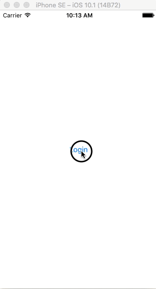

# RxIssuesViewer

In this project, you are building a small iPhone app to view issues on GitHub.

## Features

- Login
  - Authenticate with GitHub (see below for how to set this up)
- User/Organization Search
  - Should contain a `UITextField` where the user can enter the name of a GitHub user or organization
  - If a user is found, basic user info is displayed in `UILabel`s
  - There should further be an indication whether this user is of type `User` or `Organization` (e.g. by displaying a dedicated icon next to the basic user info)
  - "See repositories"-button should only be enabled when there is a valid user
  - Hint: The JSON that is returned when searching for a user contains a field called `type`
- Display Repositories
  - Display all the public repositories of the user/organization that was found on the previous view controller
  - Implement a search that allows to filter the list according to the repository name
- Display Issues
  - Display _all_ (open and closed) issues of the repository that has been selected on the previous view controller
  - Display the profile picture of the person that created the issue
  - When tapping on a cell, navigate to the actual issue in a web browser

## GitHub Authentication

GitHub uses [OAuth](https://developer.github.com/v3/oauth/) for user authentication. This starter project contains basic functionality that you can use to handle the login flow.

#### Setup

1. Go to [www.github.com](www.github.com) and log in with your user.
2. Click the profile icon on the top right and select **Settings** from the drop down menu.
3. In the left menu, selected **OAuth applications** that you find in section **Developer settings**. 
4. Click on the button that is labelled **Register a new application**.
5. For the **Application name**, enter `RxIssuesViewer`.  
6. For the **Homepage URL**, enter `http://www.google.com`.  
7. For the **Authorization callback URL**, enter `rxissuesviewer://success`.  
8. Click **Register application**.
9. Copy the **Client ID** for this application into your project and assign it to the `clientID` constant that you find in `RxGitHubAPI.swift`.
10. Copy the **Client Secret** for this application into your project and assign it to the `clientSecret` constant that you find in `RxGitHubAPI.swift`.

#### Usage

The starter project already contains a `LoginViewController` whose only UI element is a login button. When the users taps this button, they will be forwarded to `https://github.com/login/oauth/authorize` that is opened in a web browser to provide username and password.

After a successful login and authorization for the application, the app receives a `code` from the GitHub API. This code can now be exchanged for an _access token_ that has to be attached to all subsequent API requests. The access token can be retrieved using the `authenticate(with:)` function that you find in `RxGitHubAPI` class.